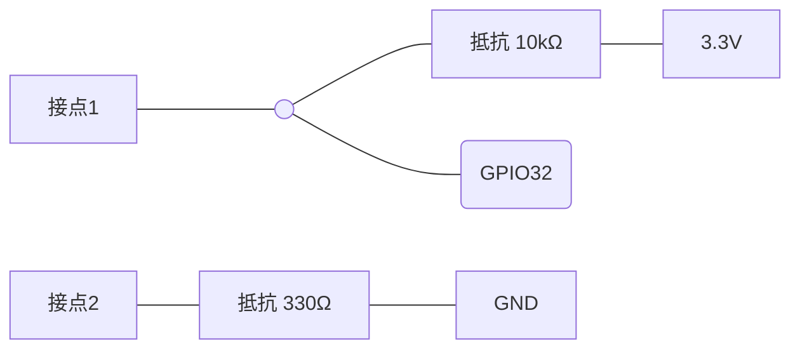
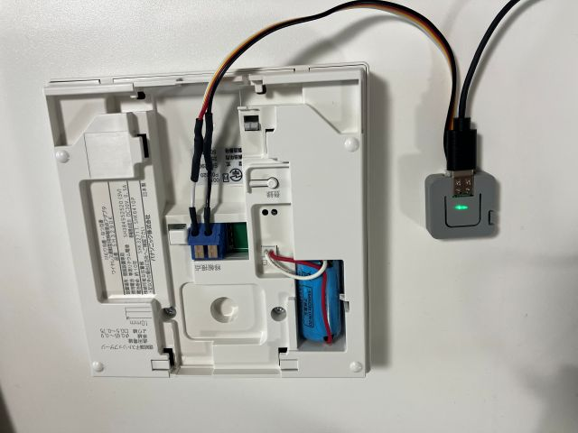

# 火災報知器の警報をLINEに通知する for M5Stack Atom Lite


M5Stack Atom Liteを火災報知器の無電圧接点に繋いで、警報が鳴ったらLINE Messageing APIを通じてLINEに通知するプログラムです。

## 想定環境

- Panasonic SH3290K
- M5Stack Atom Lite
- ESP32 Arduino Core 3.0環境（Watch Dog Timer関連）

## 配線方法




## 使用するライブラリ

- M5Unified
- [ESP32 LINE Messaging API Library](https://github.com/tomorrow56/ESP32_LINE_Messaging_API)

## 設定方法

1. WIFI_SSID, WIFI_PASS にWiFiのSSID, PASSWORDを設定する。
2. ACCESS_TOKEN にLINEのチャネルアクセストークンを設定する。

## 動作

### 基本動作

1. 電源が入るとWiFiに接続します。（LED黄色）
2. WiFiに接続完了（LED緑）、以下監視モードに入ります。
3. 警報が鳴ったらLINEで通知します。（LED赤）

警報が鳴ったあと、連続して通知されるのを避けるため、通知後3分間は通知しません。3分後経過後も警報が鳴っている場合は再び通知します。変更したい場合は REPEAT_ALARM_TIME を修正します。
```c++
const uint32_t REPEAT_ALARM_TIME = 60*3; // 警報メッセージを送信する間隔(s)
```

### 定期お知らせ

ちゃんと通知機能が動作していることを知らせるために、1週間に一度テストの通知が行われます。変更したい場合は REPEAT_TEST_TIME を修正します。
```c++
const uint32_t REPEAT_TEST_TIME = 86400*7;  // テストメッセージを送信する間隔(s)
```

### 通知デバッグ

Aボタンを1秒間長押しすると、テストの通知が行われます。

### Watch Dog Timer

プログラムが途中で止まったり、WiFiが切断されて復帰しない場合は、自動的にリセットがかかるようになっています。デフォルトでは5分です。


